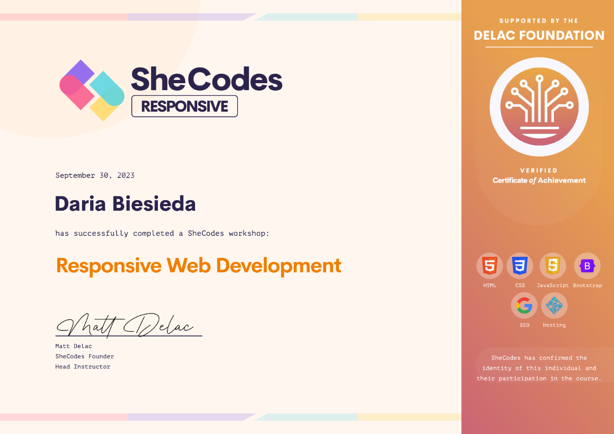
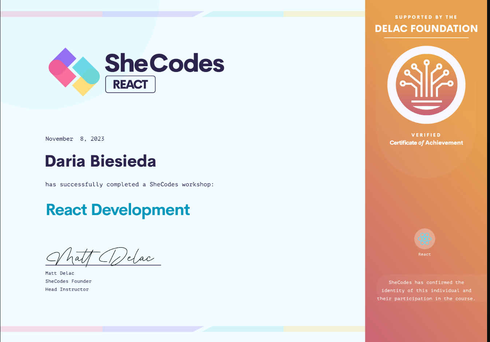

# Hallo! Ich bin angehende Fachinformatikerin für Anwendungsentwicklung
👋  I’m @daria-biesieda
Willkommen auf meinem GitHub-Profil!  
Ich bin eine motivierte Quereinsteigerin mit großem Interesse an Webentwicklung und Programmierung.  
Derzeit lerne ich:
- HTML & CSS
- JavaScript
- Python
- Lua
-  AI
- Git & GitHub
## 🚀 Ziele
- Aufbau eines eigenen Portfolios mit echten Projekten
- Start einer Ausbildung als Fachinformatikerin für Anwendungsentwicklung ab 2025
- Weiterentwicklung im Bereich Frontend-Entwicklung

## 📜 Certificates

  
  

## 📂 Projekte
Meine aktuellen und zukünftigen Projekte findest du in den Repositories unten.  
Ich arbeite aktiv an Web-Anwendungen und kleinen Tools, um mein Wissen zu vertiefen.

## 📫 Kontakt
- Portfolio-Seite: (bald verfügbar unter `###`)
---

*Vielen Dank fürs Vorbeischauen!*

<!---
daria-biesieda/daria-biesieda is a ✨ special ✨ repository because its `README.md` (this file) appears on your GitHub profile.
You can click the Preview link to take a look at your changes.
--->
