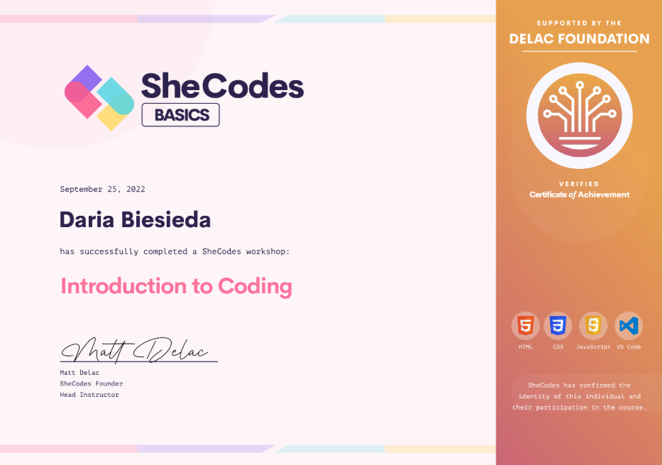
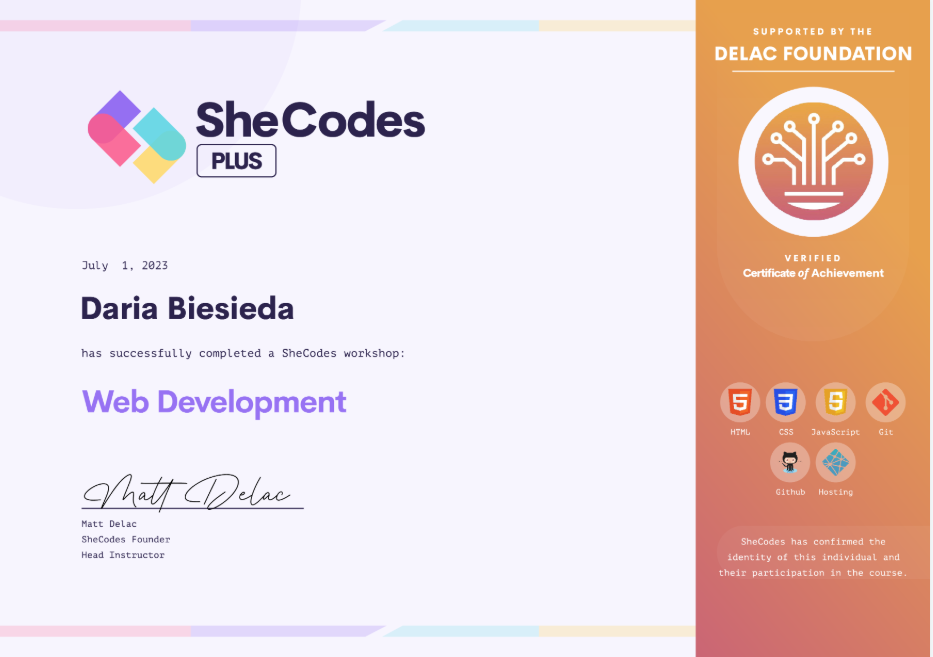

# Hallo! Ich bin angehende Fachinformatikerin für Anwendungsentwicklung
👋  I’m @daria-biesieda
Willkommen auf meinem GitHub-Profil!  
Ich bin eine motivierte Quereinsteigerin mit großem Interesse an Webentwicklung und Programmierung.  
Derzeit lerne ich:
- HTML & CSS
- JavaScript
- Python
- React
- Lua
-  AI
- Git & GitHub

  ## 🛠 Skills
- **HTML5** — solid knowledge of semantic markup  
- **CSS3** — responsive and cross-browser layouts  
- **JavaScript** — basic knowledge, DOM manipulation, events  
- **React (beginner)** — components, props, basic state management  
- **Python (beginner)** — syntax fundamentals, simple projects  
- **Git/GitHub** — version control, commits, pull requests
  
## 🚀 Ziele
- Aufbau eines eigenen Portfolios mit echten Projekten
- Start einer Ausbildung als Fachinformatikerin für Anwendungsentwicklung ab 2025
- Weiterentwicklung im Bereich Frontend-Entwicklung

## 📜 Certificates

  
  
  
  

## 📂 Projekte
- [Bakery Landing Page](https://github.com/daria-biesieda/moderne-backerei-1)
- [Roblox Gaame](https://github.com/daria-biesieda/roblox-first-project-lua)
- [Dino Game](https://github.com/daria-biesieda/dino-game)

## 📫 Kontakt
- Portfolio-Seite(2023): (https://deft-narwhal-77936b.netlify.app/)
---

*Vielen Dank fürs Vorbeischauen!*

<!---
daria-biesieda/daria-biesieda is a ✨ special ✨ repository because its `README.md` (this file) appears on your GitHub profile.
You can click the Preview link to take a look at your changes.
--->
